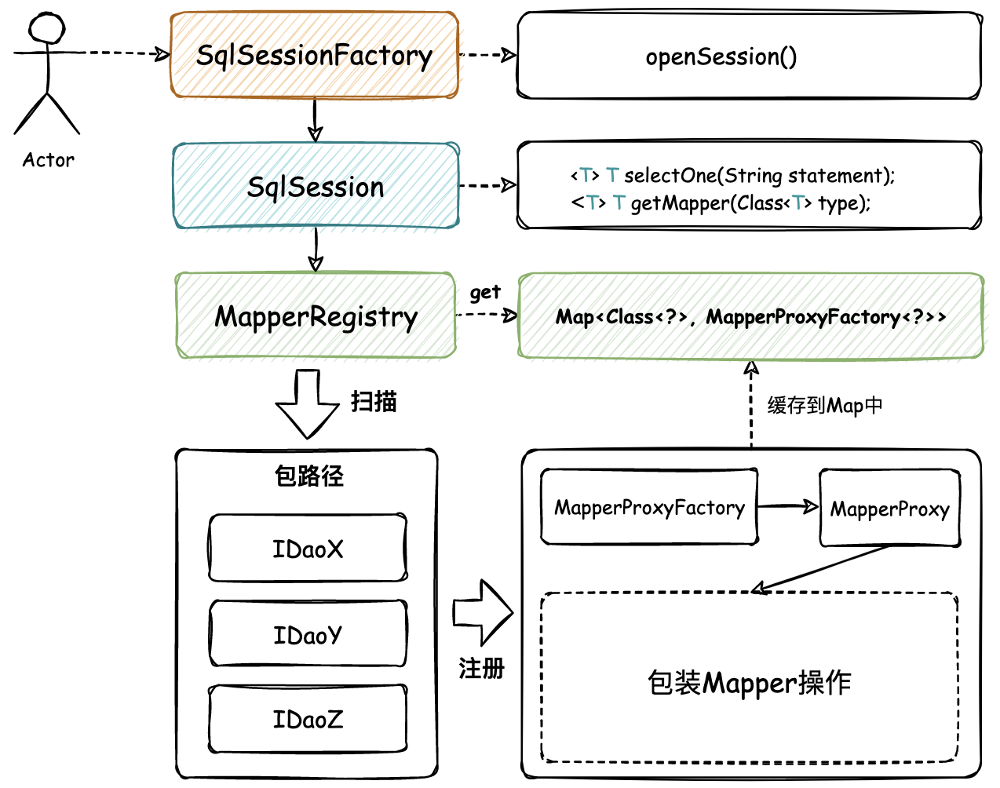
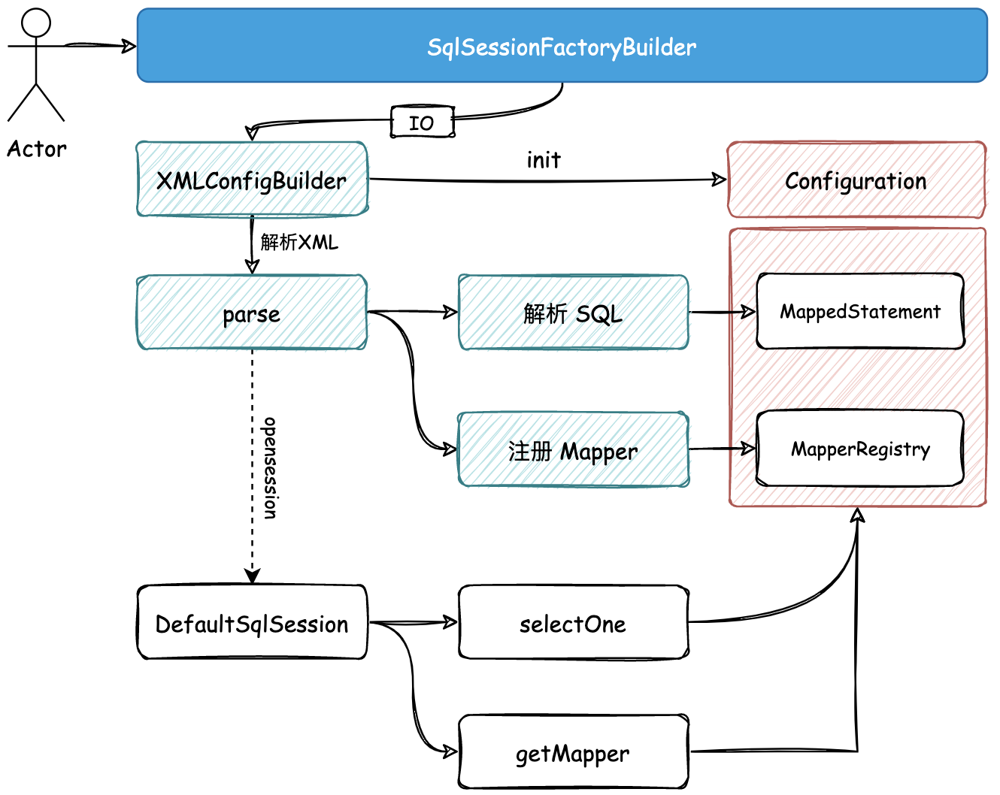

# 手写Mybatis
## 了解MyBatis
&emsp;MyBatis（前身为iBATIS）是一个用于简化数据库访问层的持久化框架，它提供了一种优雅的方式来进行数据库操作。 
&emsp;日常开发中使用MyBatis让数据库操作更加简单，提高开发效率。更容易维护，并且能够充分利用现有的SQL语句和存储过程。 
 
MyBatis的主要特点包括： 

1. 基于SQL的语言映射：MyBatis使用XML或注解来定义SQL语句，使得开发人员可以专注于业务逻辑而不是SQL语句的编写。
2. 参数映射和结果映射：MyBatis提供了灵活的参数映射和结果映射机制，使得开发人员可以方便地将Java对象与数据库中的数据进行映射。
3. 事务管理：MyBatis提供了一种简单的方式来管理事务，使得开发人员可以专注于业务逻辑而不是事务的管理。
4. 缓存机制：MyBatis提供了缓存机制，可以提高查询效率。
5. 插件机制：MyBatis提供了一种插件机制，使得开发人员可以定制化自己的插件。

使用MyBatis需要进行以下步骤： 

1. 配置MyBatis的配置文件，包括数据库连接信息、映射文件的位置等。
2. 创建映射文件，用于定义SQL语句和Java对象之间的映射关系。
3. 创建Java对象，用于封装数据。
4. 创建Mapper接口，用于定义数据库操作的方法。
5. 在Mapper接口中使用@Select、@Insert、@Update、@Delete等注解来定义SQL语句。
6. 在Java代码中，通过SqlSessionFactory来获取SqlSession对象，通过SqlSession对象来执行数据库操作。
7. 处理查询结果，将数据库中的数据映射到Java对象中。

通过以上步骤，就可以使用MyBatis来简化数据库访问层的持久化操作了。

##  开始手写MyBatis
### 第一章
1. 创建一个Maven父项目，添加JUnit 4依赖方便后续测试
2. 创建一个Day01子模块，复习[动态代理](https://wllomve.top/article?id=64)相关知识，测试了解Proxy类的创建代理实例。
3. 创建了一个UserDao模拟数据库操作。
4. 创建MapperProxy映射器与MapperProxyFactory映射器代理工厂实现动态代理。
5. 模拟测试Mapper代理过程

### 第二章
&emsp;上一章节是通过动态代理将UserDao借口硬编码注入到MapperProxy中。这一章则是想通过MapperRegistry扫描dao包，
将其下的Dao接口自动注入到MapperProxy中。 

### 第三章
&emsp;&emsp;上一章实现了对dao包下Dao接口的自动读取与注入。使得后续使用某个Dao接口时不需要再一个一个手动注入。  
&emsp;&emsp;本章的目标则是实现读取 MyBatis 中 xml 文件中 SQL 语句的功能。
1. 首先定义 SqlSessionFactoryBuilder 工厂建造者模式类，并使用 I/O 流对 XML 文件进行一个解析处理(这里以解析其中 SQL 语句为主) 
2. 定义 Configuration 配置类，文件解析之后都会存放于此。
3. 引入 DOM4j 依赖处理 xml 文件内容
