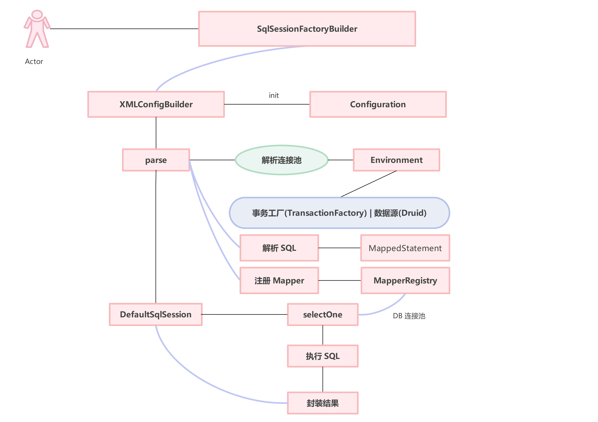

# 手写Mybatis
## 了解MyBatis
&emsp;MyBatis（前身为iBATIS）是一个用于简化数据库访问层的持久化框架，它提供了一种优雅的方式来进行数据库操作。<br>
&emsp;日常开发中使用MyBatis让数据库操作更加简单，提高开发效率。更容易维护，并且能够充分利用现有的SQL语句和存储过程。<br>
<br>
MyBatis的主要特点包括：<br>

1. 基于SQL的语言映射：MyBatis使用XML或注解来定义SQL语句，使得开发人员可以专注于业务逻辑而不是SQL语句的编写。
2. 参数映射和结果映射：MyBatis提供了灵活的参数映射和结果映射机制，使得开发人员可以方便地将Java对象与数据库中的数据进行映射。
3. 事务管理：MyBatis提供了一种简单的方式来管理事务，使得开发人员可以专注于业务逻辑而不是事务的管理。
4. 缓存机制：MyBatis提供了缓存机制，可以提高查询效率。
5. 插件机制：MyBatis提供了一种插件机制，使得开发人员可以定制化自己的插件。

使用MyBatis需要进行以下步骤：<br>

1. 配置MyBatis的配置文件，包括数据库连接信息、映射文件的位置等。
2. 创建映射文件，用于定义SQL语句和Java对象之间的映射关系。
3. 创建Java对象，用于封装数据。
4. 创建Mapper接口，用于定义数据库操作的方法。
5. 在Mapper接口中使用@Select、@Insert、@Update、@Delete等注解来定义SQL语句。
6. 在Java代码中，通过SqlSessionFactory来获取SqlSession对象，通过SqlSession对象来执行数据库操作。
7. 处理查询结果，将数据库中的数据映射到Java对象中。

通过以上步骤，就可以使用MyBatis来简化数据库访问层的持久化操作了。

##  开始手写MyBatis
### 第一章
1. 创建一个Maven父项目，添加JUnit 4依赖方便后续测试
2. 创建一个Day01子模块，复习[动态代理](https://wllomve.top/article?id=64)相关知识，测试了解Proxy类的创建代理实例。
3. 创建了一个UserDao模拟数据库操作。
4. 创建MapperProxy映射器与MapperProxyFactory映射器代理工厂实现动态代理。
5. 模拟测试Mapper代理过程

### 第二章
&emsp;上一章节是通过动态代理将UserDao借口硬编码注入到MapperProxy中。这一章则是想通过MapperRegistry扫描dao包，
将其下的Dao接口自动注入到MapperProxy中。<br>


### 第三章
&emsp;&emsp;上一章实现了对dao包下Dao接口的自动读取与注入。使得后续使用某个Dao接口时不需要再一个一个手动注入。 <br>
&emsp;&emsp;本章的目标则是实现读取 MyBatis 中 xml 文件中 SQL 语句的功能。
1. 首先定义 SqlSessionFactoryBuilder 工厂建造者模式类，并使用 I/O 流对 XML 文件进行一个解析处理(这里以解析其中 SQL 语句为主)<br>
2. 定义 Configuration 配置类，文件解析之后都会存放于此。
3. 引入 DOM4j 依赖处理 xml 文件内容


### 第四章
&emsp;&emsp;上一章解析出 XML 文件中的 SQL 语句，将其进行了简单的处理和打印输出<br>
&emsp;&emsp;本章将读取 XML 文件中的数据库相关配置，利用 Druid 连接池，结合读取出的 SQL 语句进行简单的 JDBC 操作


### 第五章
&emsp;&emsp;本章将在上一章的基础上，进一步探讨数据库连接管理的优化技术，主要集中在数据源池化技术的应用，包括有池化和无池化两种方式。在有池化的情况下，将介绍如何使用工厂模式获取数据源，通过合理的连接池管理，提高数据库连接的利用率和性能。同时，还将引入代理模式，以更灵活、安全地创建数据库连接。

**1. 数据源池化技术：**

&emsp;&emsp;在有池化的情况下，我们将通过维护一个连接池，避免频繁地打开和关闭数据库连接，从而提高系统的性能。连接池中的连接可以被重复利用，减少了连接的创建和销毁开销，同时也避免了连接资源被滥用。<br>

&emsp;&emsp;在无池化的情况下，每次需要连接数据库时都会创建新的连接，而在使用完毕后再关闭。这种方式的性能相对较差，因为连接的创建和销毁会消耗较多的资源，特别是在高并发的情况下。<br>

**2. 工厂模式获取数据源：**

&emsp;&emsp;工厂模式是一种创建型设计模式，它提供了一种统一的接口，用于创建对象，但由子类决定要实例化的类。在数据库连接管理中，工厂模式可以用于动态获取数据源，根据配置或条件返回合适的连接池实现。<br>

```java
public interface DataSourceFactory {
    DataSource getDataSource();
}

public class PoolingDataSourceFactory implements DataSourceFactory {
    @Override
    public DataSource getDataSource() {
        // 返回具体的池化数据源实现
    }
}

public class NoPoolingDataSourceFactory implements DataSourceFactory {
    @Override
    public DataSource getDataSource() {
        // 返回无池化的数据源实现
    }
}
```

**3. 代理模式创建连接：**

&emsp;&emsp;代理模式可以用于在访问一个对象时引入一些附加的操作，例如在创建数据库连接时进行权限验证、性能监控等。在数据库连接管理中，代理模式可以帮助我们在连接被获取或释放时执行一些额外的逻辑。<br>

```java
public class PoolConnection implements InvocationHandler {

    public PoolConnection(Connection connection, PoolDataSource dataSource) {
        // 初始化连接和数据源配置
    }

    @Override
    public Object invoke(Object proxy, Method method, Object[] args) {
        String methodName = method.getName();
        // 若调用 close 关闭链接方法，则将链接加入至连接池中，并返回null
        if (CLOSE.hashCode() == methodName.hashCode() && CLOSE.equals(methodName)) {
            dataSource.pushConnection(this);
            return null;
        } else {
            // 否则执行原来的逻辑
            if (!Object.class.equals(method.getDeclaringClass())) {
                // 除 toString() 方法，其他方法调用之前要检查 connection 是否合法
                checkConnection();
            }
        }
        // 其余方法则交给 connection 去调用
        return method.invoke(realConnection, args);
    }
}

```

### 第六章
&emsp;&emsp;本章将定义和实现 SQL 执行器，目的在于将 DefaultSqlSession 中的 selectOne 方法进行解耦，方便后续维护和功能的扩展。<br>
&emsp;&emsp;之前是将全部的功能逻辑耦合在 DefaultSqlSession 中的 selectOne 方法中。
```java
public record DefaultSqlSession(Configuration configuration) implements SqlSession {
    // 其余方法...
    @Override
    public <T> T selectOne(String statement, Object parameter) {
        try {
            MappedStatement mappedStatement = configuration.getMappedStatement(statement);
            Environment environment = configuration.getEnvironment();
            Connection connection = environment.dataSource().getConnection();
            BoundSql boundSql = mappedStatement.getBoundSql();
            PreparedStatement preparedStatement = connection.prepareStatement(boundSql.sql());
            preparedStatement.setLong(1, Long.parseLong(((Object[]) parameter)[0].toString()));
            ResultSet resultSet = preparedStatement.executeQuery();
            List<T> objList = resultSet2Obj(resultSet, Class.forName(boundSql.resultType()));
            return objList.get(0);
        } catch (Exception e) {
            e.printStackTrace();
            return null;
        }
    }
    // 其余方法...
}
```
&emsp;&emsp;而 MyBatis 中并不是这样做的，而是将上面的功能逻辑迁移出去，实现职责分离，提供一个专门的执行器。而 SqlSession 只是定义了一些标准的执行接口，而真正执行功能逻辑时是通过直接调用执行器。通过执行器实例化链接，进行参数化，并执行 SQL 语句，最终返回结果。

### 第七章
&emsp;&emsp;前面几章在实现数据源池化时，对于属性信息的获取都是采用直接硬编码的方式。
```java
public class PoolDataSourceFactory extends UnpoolDataSourceFactory {
    
    @Override
    public DataSource getDataSource() {
        PoolDataSource dataSource = new PoolDataSource();
        dataSource.setDriver(properties.getProperty("driver"));
        dataSource.setUrl(properties.getProperty("url"));
        dataSource.setUsername(properties.getProperty("username"));
        dataSource.setPassword(properties.getProperty("password"));
        return dataSource;
    }
}
```
&emsp;&emsp;对于上面的 username、password 等都是标准的字段，采用硬编码方式获取并非不对。但其实除了这些字段以外，可能有时候还需要配置一些扩展字段，这时如果再通过硬编码的方式进行获取，每次都需要修改大量代码，而且容易产生大量冗余。<br>
这时便可以利用反射，实现一个反射工具包，完成一个对象的属性的反射填充。<br>
&emsp;&emsp;若需要对一个对象的所提供的属性进行统一的设置和获取值的操作，那么就需要把当前这个被处理的对象进行解耦，提取所有的属性和方法，并按照不同的类型进行反射处理，从而包装成一个工具包。<br>
&emsp;&emsp;对于一个对象，整个的设计过程都是围绕拆解对象提供反射操作为主，即所包括的有对象的构造函数、对象的属性、对象的方法。而对象的方法基本上都是获取和设置值的操作(故为get、set处理)，则将这些方法在对象拆解的过程中摘取出来进行保存。<br>
当真正需要对对象进行操作时，则会依赖于已经实例化的对象，将其进行属性处理。处理过程是使用 JDK 所提供的反射进行操作，在反射过程中的方法名称、入参类型的都已经被拆解和处理，在最终使用时直接调用即可。<br>

### 第八章
 &emsp;&emsp;在前面的几个章节中关于 ORM 框架的大部分核心结构已经逐渐表现出来(其中就包括解析 XML 文件和 SQL 语句，SQL 语句的绑定，语句映射，事务处理，语句执行，配置不同数据源等)。<br>
 &emsp;&emsp;但是随着框架越来越多功能的逐步完善，需要对模块内部的实现进行细分处理，并不是单单通过硬编码的方式完成功能逻辑，而是使用设计原则进行拆分和解耦，满足代码的易维护性和可拓展性。<br>
 &emsp;&emsp;本章节将先从 XML 解析的问题，将之前的硬编码实现方式细化，满足在解析时对一些参数的整合和处理。<br>
 &emsp;&emsp;之前的 XML 解析代码是将所有的解析都放在一个循环中进行处理，并且只能解析 environment 与 mapper 配置，后续当要解析其他配置时需要添加和修改大量的代码，这样会大大增加之后的维护成本(XMLConfigBuilder 类)。
```java
public class XMLConfigBuilder extends BaseBuilder {
    // 其他的代码
    public Configuration parse(){
        // 解析映射器
        try {
            // 环境
            environmentsElement(root.element("environments"));
            // 解析映射器
            mapperElement(root.element("mappers"));
        } catch (Exception e) {
            throw new RuntimeException("SQL 映射器解析错误，造成的原因是："+e);
        }
        return configuration;
    }

    private void environmentsElement(Element context) throws Exception {
        // 具体代码实现...
    }


    private void mapperElement(Element mappers) throws Exception{
        // 具体代码实现...
    }
    // 其他的代码
}
```
而本章则是在整个解析过程中引入映射构建器( XMLMapperBuilder )、语句构建器( XMLStatementBuilder )，按照其不同的职责进行解析<br>
同时在 XMLStatementBuilder 中引入了脚本语言驱动器(默认实现的是 XML 语言驱动器 XMLLanguageDriver )，该类具体操作静态和动态 SQL 语句节点的解析(这里参照 MyBatis 源码使用 Ognl 的方式进行处理，其对应的类是 DynamicContext)。
 